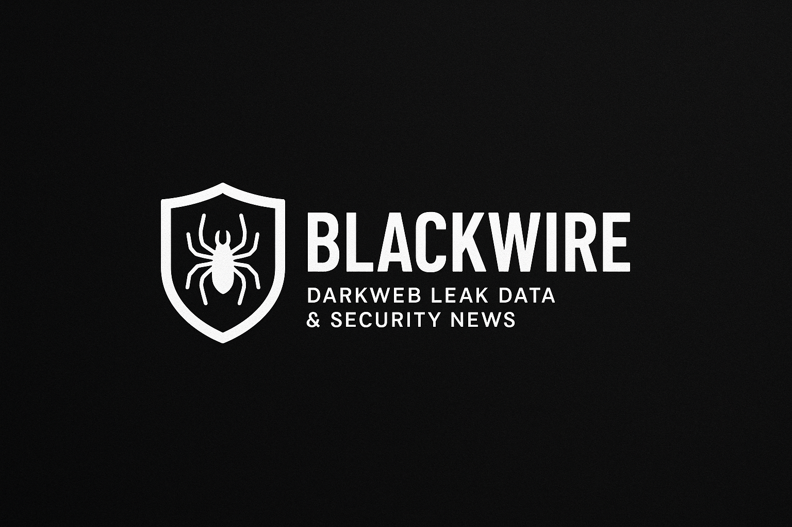

# 🕷️ Playwright Crawler Dashboard

<div align="center">
  
</div>

A Dockerized web crawler for security intelligence – supporting news, dark web leaks, and MITRE ATT\&CK mapping.

✅ **Tested on:** macOS with M2 chip
⚠️ You should fill up you own .env file 
-

---

## 🛠️ Initialization

```bash
# Run once before crawling
chmod +x ./scripts/init.sh
./scripts/init.sh
```

---

## Dark Web Crawling

```bash
# Crawl onion sites through Tor proxy
chmod +x ./scripts/run_compose.sh
./scripts/run_compose.sh
```

---

## Dark Web Info Extraction & MITRE Matching

```bash
# Extract leaked info, match CVEs to MITRE ATT&CK
chmod +x ./scripts/run_extract.sh
./scripts/run_extract.sh
```

---

## News Crawling (Open Web)

```bash
# Run Node.js-based crawler
chmod +x ./scripts/run_node.sh
./scripts/run_node.sh

# Run Playwright-based crawler
chmod +x ./scripts/run_playwright.sh
./scripts/run_playwright.sh
```

> **Supported sources**:
> `gbhackers`, `security_affairs`, `thehackernews`, `securityweek`, `boannews`, `ransomwatch`

---

## Visualization & Streamlit Dashboard

```bash
cd ./visualization
streamlit run app.py
```

> You can explore:
>
> * Threat group clustering
> * CVE & MITRE TTP mapping
> * Darkweb activity summaries
> * Gemini-based LLM summaries

---

## 📂 Output Directory

All `.txt` and `.png` output files will be saved under:

```
/app/downloads
```

---

## 🔑 Keyword-Based Crawling

> You can specify ransomware group names (e.g., `lockbit`, `alphv`, `babuk`)
> as **KEYWORDS** in your crawling config files.

---

## 🧩 Stack

* ✅ Playwright + Node.js + Python
* 🔐 Tor Proxy for .onion access
* 📄 MITRE ATT\&CK enrichment
* 🤖 Google Gemini LLM summarization
* 🖼️ Streamlit for interactive dashboard

---

Feel free to contribute, open issues, or customize it for your threat intel needs!
